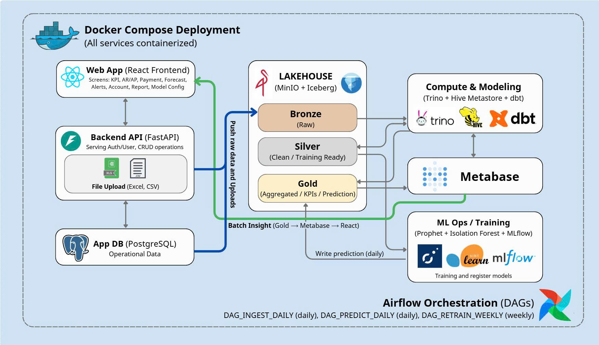

# 🚀 SME Pulse - Financial Analytics Platform

[](https://www.python.org/downloads/)
[](https://fastapi.tiangolo.com/)
[](https://reactjs.org/)
[](https://docs.docker.com/compose/)
[](https://www.uit.edu.vn/)

> **A modern, production-ready Financial Analytics Platform for SMEs, powered by Lakehouse Architecture (Trino + Iceberg + MinIO), AI/ML forecasting (Prophet, Isolation Forest), and Real-time Analytics.**
> 
> 🎓 **Academic Project** | University of Information Technology - Vietnam National University Ho Chi Minh City

---

## 📋 Table of Contents

- [🎯 Features](#-features)
- [🏗️ Architecture](#️-architecture)
- [🛠️ Technology Stack](#️-technology-stack)
- [📁 Project Structure](#-project-structure)
- [🚀 Quick Start](#-quick-start)
- [✅ Project Improvements (Phase 0-3)](#-project-improvements-phase-0-3)
- [📊 Use Cases](#-use-cases)
- [🔐 Security & RBAC](#-security--rbac)
- [📚 Documentation](#-documentation)
- [🤝 Contributing](#-contributing)

---

## 🎯 Features

### Core Financial Management
- ✅ **Accounts Receivable (AR)** - Aging reports, customer credit management
- ✅ **Accounts Payable (AP)** - Supplier payment tracking, aging analysis
- ✅ **Payment Reconciliation** - Auto-match bank transactions with system payments
- ✅ **Cash Flow Dashboard** - Real-time KPIs: DSO, DPO, CCC, Working Capital

### AI/ML Analytics
- 🤖 **Prophet Cashflow Forecast** - 30-day revenue prediction with 95% confidence intervals
- 🚨 **Anomaly Detection** - Isolation Forest for detecting unusual transactions (CRITICAL, HIGH, MEDIUM severity)
- 📈 **AR Priority Scoring** - Heuristic-based debt collection prioritization

### Data Pipeline
- 🏗️ **Medallion Architecture** - Bronze (raw) → Silver (staging) → Gold (analytics)
- ⚙️ **ETL Orchestration** - Airflow DAGs for daily ETL and weekly ML training
- 💾 **Lakehouse Storage** - Trino + Iceberg + MinIO for scalable OLAP queries
- 🔄 **dbt Transformations** - Modular SQL models with lineage tracking

### Developer Experience
- 🐳 **Docker Compose** - One-command deployment (11 default services, optional dbt profile)
- 🔒 **JWT Authentication** - Secure API access with role-based authorization
- 📊 **Metabase Integration** - Embedded BI dashboards
- 🚀 **React + FastAPI** - Modern frontend with async backend

---

## 🏗️ Architecture

### System Overview

<p align="center">
  
</p>

### Medallion Architecture Flow

```
1. BRONZE (Raw Data)
   ├── Source: Excel/CSV uploads, API ingestion
   ├── Storage: MinIO S3 (Parquet format)
   └── Schema: Unvalidated, original structure

2. SILVER (Staging & Feature Engineering)
   ├── dbt transformations (stg_*, fct_*)
   ├── Data cleaning, type casting
   ├── ML feature engineering
   └── Schema: Normalized, typed

3. GOLD (Analytics & ML)
   ├── Fact tables (fact_sales, fact_bank_txn)
   ├── Dimension tables (dim_customer, dim_location)
   ├── ML scores (ml_cashflow_forecast, ml_anomaly_alerts)
   └── Schema: Optimized for queries
```

---

## 🛠️ Technology Stack

### Backend
| Technology | Version | Purpose |
|------------|---------|---------|
| **FastAPI** | 0.104+ | Async REST API with automatic OpenAPI docs |
| **PostgreSQL** | 15 | OLTP database (users, invoices, payments) |
| **SQLAlchemy** | 2.0+ | Async ORM with multi-tenancy support |
| **Pydantic** | 2.0+ | Request/Response validation |
| **Redis** | 7 | Multi-level caching (30-min TTL) |
| **Celery** | 5.3+ | Background tasks (Excel export) |

### Frontend
| Technology | Version | Purpose |
|------------|---------|---------|
| **React** | 18.2 | UI components with hooks |
| **Vite** | 4.5+ | Fast build tool |
| **React Query** | 4.0+ | Server state management with caching |
| **Axios** | 1.6+ | HTTP client with interceptors |
| **Recharts** | 2.10+ | Data visualization (forecasts, charts) |
| **shadcn/ui** | Latest | Tailwind-based UI components |

### Data Platform
| Technology | Version | Purpose |
|------------|---------|---------|
| **Trino** | 426+ | Distributed SQL query engine |
| **Iceberg** | 1.4+ | Open table format with ACID transactions |
| **MinIO** | Latest | S3-compatible object storage |
| **Hive Metastore** | 3.1+ | Iceberg catalog metadata |
| **dbt** | 1.8+ | SQL transformations with testing |
| **Airflow** | 2.9+ | Workflow orchestration with DAGs |

### AI/ML
| Technology | Version | Purpose |
|------------|---------|---------|
| **Prophet** | 1.1+ | Time-series forecasting (Facebook) |
| **scikit-learn** | 1.3+ | Isolation Forest for anomaly detection |
| **MLflow** | 2.10+ | Model versioning and tracking |
| **pandas** | 2.1+ | Data manipulation |

### DevOps
| Technology | Version | Purpose |
|------------|---------|---------|
| **Docker** | 24+ | Containerization |
| **Docker Compose** | 2.20+ | Multi-container orchestration |
| **Metabase** | Latest | Embedded BI dashboards |

---

## 📁 Project Structure

```
sme-pulse/
├── 📄 README.md                    # This file
├── 🐳 docker-compose.yml           # 11 default services orchestration (+ optional dbt profile)
├──  docs/                        # Documentation
│   ├── architecture/               # System design docs
│   │   ├── CURRENT_SYSTEM_STATUS.md       # Complete system status report
│   │   ├── API_AUDIT_REPORT.md            # API endpoint documentation
│   │   ├── LAKEHOUSE_KINH_NGHIEM.md       # Lakehouse best practices
│   │   └── SME_Pulse_Data_Pipeline_VN.md  # Pipeline architecture
│   ├── design/                     # Database & schema design
│   │   ├── Schema_design_ML_featuring.md  # ML feature design
│   │   ├── schema_design_guide.txt        # Schema guidelines
│   │   └── schema.yml                     # dbt schema YML
│   ├── diagrams/                   # PlantUML diagrams
│   │   ├── UC05_UC06_diagram.pu           # AR/AP & Reconciliation flow
│   │   ├── UC09_diagram.pu                # Prophet Forecast flow
│   │   └── UC10_diagram.pu                # Anomaly Detection flow
│   ├── setup/                      # Installation guides
│   │   ├── SETUP_GUIDE.md                 # Complete setup instructions
│   │   ├── RESTORATION_REPORT.md          # Disaster recovery guide
│   │   └── EXTERNAL_DATA_INTEGRATION.md   # External API integration
│   └── reports/                    # Project reports
│       ├── PHASE_A_COMPLETION_REPORT.md   # Phase A summary
│       └── FINAL_INTEGRATION_PLAN.md      # Integration roadmap
├── 🔙 backend/                     # FastAPI backend
│   ├── app/
│   │   ├── main.py                        # FastAPI app initialization
│   │   ├── core/                          # Config, security, logging
│   │   ├── models/                        # SQLAlchemy ORM models
│   │   ├── schema/                        # Pydantic request/response schemas
│   │   ├── modules/                       # Business logic (auth, finance, analytics)
│   │   ├── middleware/                    # Security, rate limit, CORS
│   │   └── db/                            # Database session, base classes
│   ├── alembic/                           # Database migrations
│   ├── requirements.txt
│   └── Dockerfile
├── 🎨 frontend/                    # React frontend
│   ├── src/
│   │   ├── components/                    # React components (Dashboard, Login, etc.)
│   │   ├── lib/api/                       # API client, hooks (React Query)
│   │   ├── contexts/                      # React contexts
│   │   └── pages/                         # Page layouts
│   ├── package.json
│   ├── vite.config.ts
│   └── Dockerfile
├── ⚙️ airflow/                     # Airflow orchestration
│   ├── dags/                              # DAG definitions
│   │   ├── sme_pulse_daily_etl.py         # Daily ETL (2AM)
│   │   └── sme_pulse_ml_training.py       # Weekly ML (Sunday 1AM)
│   ├── plugins/
│   ├── logs/
│   └── Dockerfile
├── 🔄 dbt/                         # dbt transformations
│   ├── models/
│   │   ├── bronze/                        # External raw tables
│   │   ├── silver/                        # Staging + features
│   │   │   ├── staging/                   # stg_* tables
│   │   │   ├── features/                  # Feature engineering
│   │   │   └── ml_training/               # ML training datasets
│   │   └── gold/                          # Analytics layer
│   │       ├── facts/                     # fact_sales, fact_bank_txn
│   │       ├── dimensions/                # dim_customer, dim_location
│   │       └── ml_scores/                 # ml_cashflow_forecast, ml_anomaly_alerts
│   ├── macros/                            # Reusable SQL functions
│   ├── seeds/                             # Static CSV data
│   ├── tests/                             # dbt tests
│   └── dbt_project.yml
├── 🧠 ops/                         # Operations & ML scripts
│   ├── ml/
│   │   ├── UC09-forecasting/              # Prophet cashflow model
│   │   │   └── train_cashflow_model.py
│   │   └── UC10-anomoly_detection/        # Isolation Forest anomaly
│   │       └── train_isolation_forest.py
│   ├── ingest_batch_snapshot.py           # Batch data ingestion
│   ├── ingest_bank_transactions.py
│   ├── ingest_invoices_ar.py
│   └── run_all_ingest.py                  # Master ingestion script
├── 🗄️ sql/                         # SQL scripts
│   ├── 00_bootstrap_schemas.sql           # Create bronze, silver, gold schemas
│   ├── 01_create_bronze_external_tables.sql
│   ├── 04_create_staging_table.sql
│   └── 05_create_fact_sales.sql
├── 🏗️ infra/                       # Infrastructure configs
│   └── trino/
│       ├── catalog/
│       │   └── sme_lake.properties        # Iceberg catalog config
│       └── config.properties
├── 🗂️ hive-metastore/              # Hive Metastore config
│   ├── Dockerfile
│   └── hive-site.xml
└── 🛠️ tools/                       # Utility scripts
    └── bootstrap_lakehouse.sh             # Initialize lakehouse
```

---

## 🚀 Quick Start

### Prerequisites

- **Docker** 24+ and **Docker Compose** 2.20+
- **Git**
- **Python** 3.11+ (for local development)
- **Node.js** 18+ (for frontend development)

### 1️⃣ Clone Repository

```bash
git clone https://github.com/your-org/sme-pulse.git
cd sme-pulse
```

### 2️⃣ Configure Environment

```bash
# Copy environment template
cp .env.example .env

# Edit .env with your settings (use any text editor)
# Note: .env is protected by .gitignore
```

### 3️⃣ Install Python Dependencies (Optional - for local dev)

```bash
# Create virtual environment
python -m venv venv
source venv/bin/activate  # Linux/Mac
# OR
venv\Scripts\activate     # Windows

# Install dependencies
pip install -r requirements.txt

# For specific components
pip install -r backend/requirements.txt
pip install -r ops/requirements_ingest.txt
```

### 4️⃣ Start Services

```bash
# Start default runtime services
docker-compose up -d

# Check service health
docker-compose ps

# View logs
docker-compose logs -f backend
```

**Services started:**
| Service | Port | URL |
|---------|------|-----|
| Backend (FastAPI) | 8000 | http://localhost:8000/api/docs |
| Airflow Web | 8080 | http://localhost:8080 (admin/admin) |
| Metabase | 3000 | http://localhost:3000 |
| MinIO Console | 9001 | http://localhost:9001 |
| Trino | 8081 | http://localhost:8081 |

**Optional profile service (not started by default):**
- dbt service: `docker compose --profile dbt up -d dbt`

### 5️⃣ Bootstrap Lakehouse

```bash
# Initialize schemas and tables
docker-compose exec trino trino --catalog sme_lake --execute "$(cat sql/00_bootstrap_schemas.sql)"

# Run initial data ingestion
docker-compose exec airflow-scheduler python /opt/ops/run_all_ingest.py
```

### 5️⃣ Run dbt Transformations

```bash
# Default runtime: execute dbt inside Airflow container (mounted at /opt/dbt)
docker-compose exec airflow-scheduler bash -lc "cd /opt/dbt && dbt run --profiles-dir /opt/dbt"

# Run dbt tests
docker-compose exec airflow-scheduler bash -lc "cd /opt/dbt && dbt test --profiles-dir /opt/dbt"

# Optional: use standalone dbt profile service
# docker compose --profile dbt up -d dbt
# docker compose exec dbt dbt run --profiles-dir /opt/dbt
```

### 6️⃣ Trigger Airflow DAGs

```bash
# Access Airflow UI: http://localhost:8080
# Username: admin, Password: admin

# Enable DAGs
# - sme_pulse_daily_etl (runs daily 2AM)
# - sme_pulse_ml_training (runs weekly Sunday 1AM)

# Manual trigger (for testing)
docker-compose exec airflow-scheduler airflow dags trigger sme_pulse_daily_etl
```

### 7️⃣ Access Frontend

```bash
# Open browser: http://localhost:5173

# Default credentials (demo user):
# Email: admin@sme.com
# Password: 123456
```

---

## 📊 Use Cases

### UC01 - Login & Authentication
- JWT-based authentication
- Role-based access control (owner, accountant, cashier)
- Password hashing with bcrypt

### UC05 - Accounts Receivable (AR) Management
- AR aging report (0-30, 31-60, 61-90, >90 days)
- Customer credit limit tracking
- Invoice status management

### UC06 - Accounts Payable (AP) Management
- AP aging report
- Supplier payment scheduling
- Bill tracking

### UC07 - Payment Reconciliation
- Auto-match bank transactions with system payments (tolerance ±1000 VND)
- Manual confirm/reject workflow
- Audit trail for reconciliation actions

### UC08 - Dashboard Analytics
- Real-time KPIs: DSO, DPO, CCC, Working Capital
- Daily revenue chart (14 days)
- Payment success rate
- Overdue invoices/bills summary

### UC09 - Prophet Cashflow Forecast
- 30-day revenue prediction with 95% confidence intervals
- Seasonal adjustments (weekends, holidays, month-end)
- Retraining: Weekly (Sunday 1AM)
- Cache: 30 min (React Query + Redis)

### UC10 - Anomaly Detection
- Isolation Forest for detecting unusual transactions
- Severity levels: CRITICAL, HIGH, MEDIUM, LOW
- Features: amount, direction, category, day_of_week
- Retraining: Weekly

---

## 🔐 Security & RBAC

### Authentication
- **JWT Tokens**: HS256 algorithm (configurable via `BACKEND_ALGORITHM`) with default 30-min expiry
- **Password Hashing**: bcrypt with salt
- **Multi-tenancy**: All queries filtered by `org_id`

### Role-Based Access Control (RBAC)

| Role | Permissions |
|------|-------------|
| **Owner** | Full access (all UCs) |
| **Accountant** | Finance, Analytics (UC05-10) |
| **Cashier** | Payments, AR view only (UC05, UC07) |

### Middleware
1. **RequestContextMiddleware**: Request ID + timing
2. **SecurityHeadersMiddleware**: X-Content-Type-Options, X-Frame-Options, HSTS
3. **RateLimitMiddleware**: Max 5 login attempts per 60 seconds
4. **CORSMiddleware**: Configured origins only

---

## 📚 Documentation

### Architecture
- [System Status Report](docs/architecture/CURRENT_SYSTEM_STATUS.md) - Complete system overview
- [API Audit](docs/architecture/API_AUDIT_REPORT.md) - API endpoint documentation
- [Lakehouse Best Practices](docs/architecture/LAKEHOUSE_KINH_NGHIEM.md)

### Setup & Deployment
- [Setup Guide](docs/setup/SETUP_GUIDE.md) - Detailed installation instructions
- [Restoration Report](docs/setup/RESTORATION_REPORT.md) - Disaster recovery
- [External Data Integration](docs/setup/EXTERNAL_DATA_INTEGRATION.md)

### Design
- [Schema Design (ML Featuring)](docs/design/Schema_design_ML_featuring.md)
- [dbt Schema YML](docs/design/schema.yml)

### Diagrams
- [UC05/UC06 - AR/AP Reconciliation](docs/diagrams/UC05_UC06_diagram.pu)
- [UC09 - Prophet Forecast Flow](docs/diagrams/UC09_diagram.pu)
- [UC10 - Anomaly Detection Flow](docs/diagrams/UC10_diagram.pu)

### API Documentation
- **Swagger UI**: http://localhost:8000/api/docs
- **ReDoc**: http://localhost:8000/api/redoc

---

## 🧪 Testing

### Backend Tests
```bash
# Run all tests
docker-compose exec backend pytest

# Run with coverage
docker-compose exec backend pytest --cov=app --cov-report=html

# Test specific module
docker-compose exec backend pytest tests/test_auth.py
```

### Frontend Tests
```bash
# Run unit tests
npm test

# Run E2E tests
npm run test:e2e
```

### dbt Tests
```bash
# Default runtime: execute dbt tests from Airflow container
docker-compose exec airflow-scheduler bash -lc "cd /opt/dbt && dbt test --profiles-dir /opt/dbt"

# Optional profile service mode
# docker compose --profile dbt up -d dbt
# docker compose exec dbt dbt test --profiles-dir /opt/dbt
```

---

## 📈 Performance

### Cache Strategy
| Level | Technology | TTL | Purpose |
|-------|-----------|-----|---------|
| **L1** | React Query | 30 min | Browser cache (forecast) |
| **L2** | Redis | N/A | Celery broker/result backend + ML cache invalidation patterns |
| **L3** | Trino | Engine-managed | Query execution layer for Gold analytics |

### Typical Response Times
| Endpoint | Cache HIT | Cache MISS | Notes |
|----------|-----------|------------|-------|
| Dashboard Summary | ~5ms | ~50ms | PostgreSQL OLTP |
| AR/AP Aging | ~2ms | ~50ms | PostgreSQL |
| Prophet Forecast | ~50ms | ~400ms | Trino + Iceberg |
| Anomaly Detection | ~10ms | ~350ms | Trino + Iceberg |

---

## 🤝 Contributing

We welcome contributions! Please follow these steps:

1. Fork the repository
2. Create a feature branch (`git checkout -b feature/amazing-feature`)
3. Commit your changes (`git commit -m 'Add amazing feature'`)
4. Push to the branch (`git push origin feature/amazing-feature`)
5. Open a Pull Request

### Code Style
- **Python**: black + flake8 + isort
- **TypeScript**: eslint + prettier
- **SQL**: sqlfluff

---

## 📜 License & Attribution

This project is an academic initiative by the **University of Information Technology - Vietnam National University Ho Chi Minh City (UIT VNUHCM)**, developed as part of the Software Engineering curriculum. All rights reserved by UIT VNUHCM.

**Citation**: If you use this project in academic or professional work, please cite:
```
SME Pulse: Financial Analytics Platform
University of Information Technology - VNUHCM
https://github.com/SelinaPhan0205/SME_Pulse
```

---

## 👥 Team

### Development Team | UIT - VNUHCM (University of Information Technology)

<table>
  <tr>
    <td align="center">
      <a href="https://github.com/NATuan1208">
        
        <br />
        <sub><b>Nguyễn Anh Tuấn</b></sub>
      </a>
      <br />
      <sub>Backend Engineer & Data/MLOps Engineer</sub>
      <br />
      <a href="mailto:Tuancuoi2703@gmail.com">📧</a>
      <a href="https://github.com/NATuan1208">💻</a>
    </td>
    <td align="center">
      <a href="https://github.com/SelinaPhan0205">
        
        <br />
        <sub><b>Phan Thị Xuân Tiên</b></sub>
      </a>
      <br />
      <sub>Frontend Engineer & Data Engineer</sub>
      <br />
      <a href="https://github.com/SelinaPhan0205">💻</a>
    </td>
    <td align="center">
      <a href="https://github.com/ThSown22">
        
        <br />
        <sub><b>Nguyễn Văn Thanh Sơn</b></sub>
      </a>
      <br />
      <sub>Data Analytics Engineer</sub>
      <br />
      <a href="https://github.com/ThSown22">💻</a>
    </td>
  </tr>
</table>

### Contact

- 📧 **Project Email**: Tuancuoi2703@gmail.com
- 🏫 **Institution**: University of Information Technology - VNUHCM
- 📍 **Location**: Ho Chi Minh City, Vietnam

---

## 📞 Support

- 📧 **Email**: Tuancuoi2703@gmail.com
- 🐛 **Issues**: [GitHub Issues](https://github.com/NATuan1208/sme-pulse/issues)
- 💬 **Discussions**: [GitHub Discussions](https://github.com/NATuan1208/sme-pulse/discussions)
- 📚 **Documentation**: See [docs/](docs/) folder

---

## 🙏 Acknowledgments

- [Trino](https://trino.io) - Distributed SQL query engine
- [Apache Iceberg](https://iceberg.apache.org) - Open table format
- [dbt](https://www.getdbt.com) - Data transformation tool
- [Facebook Prophet](https://facebook.github.io/prophet/) - Time-series forecasting
- [FastAPI](https://fastapi.tiangolo.com) - Modern Python web framework
- [React](https://reactjs.org) - UI library

---

<div align="center">

**Built with ❤️ for SMEs**

[⬆ Back to Top](#-sme-pulse---financial-analytics-platform)

</div>
